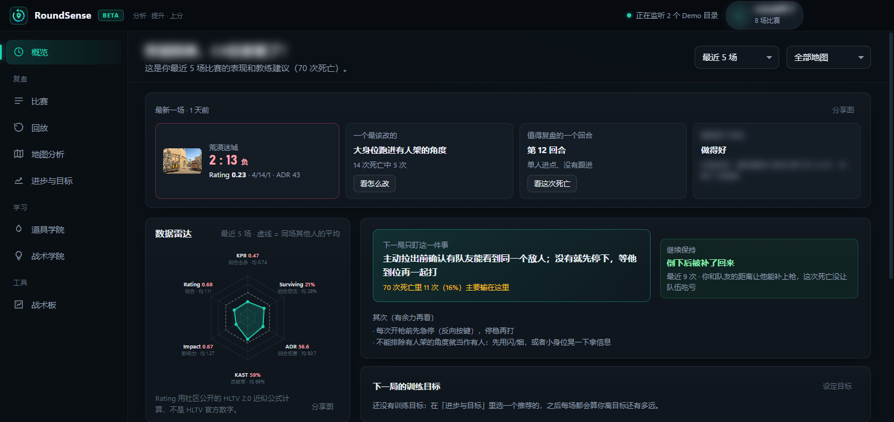
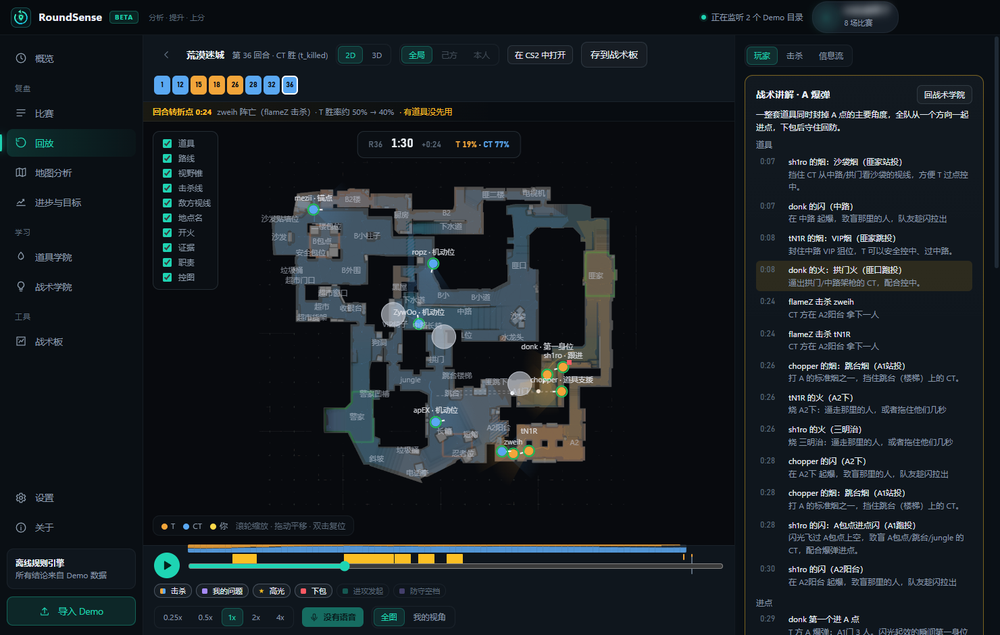
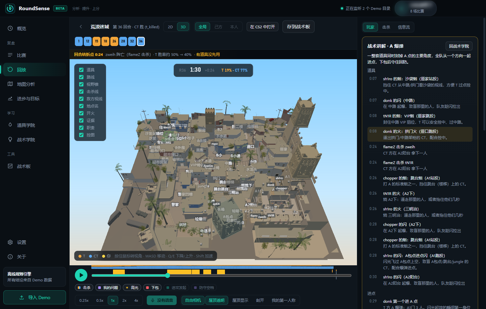
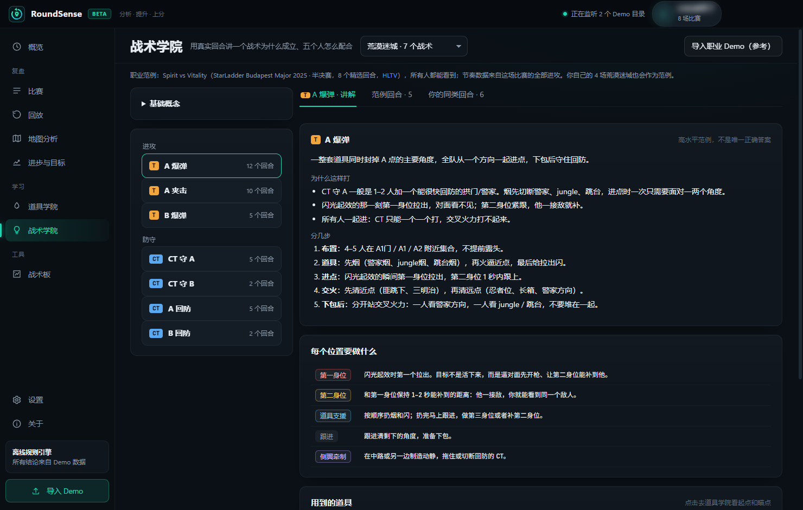
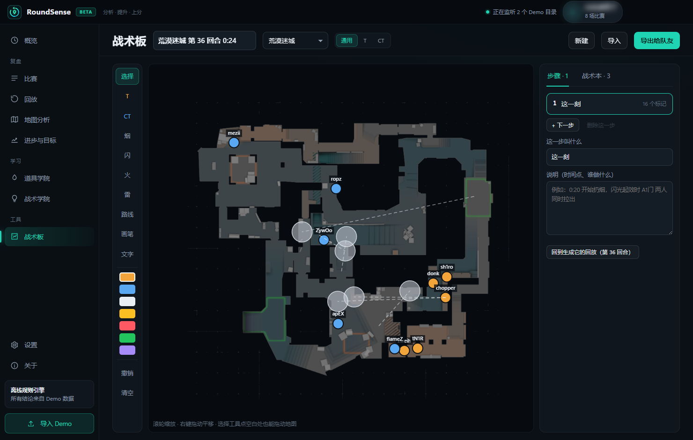
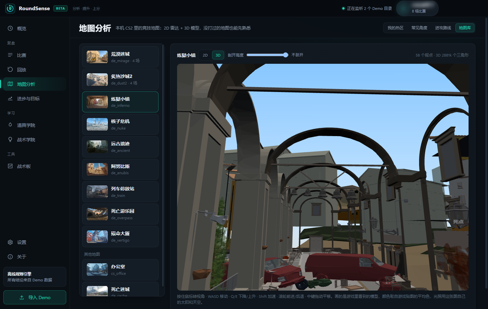

# RoundSense

**CS2 赛后复盘教练：把你的比赛 Demo 变成证据，再把证据变成下一局能改的一件事。**

**简体中文** | [English](README.en.md)

Windows 桌面应用 · 本地解析 · 免费使用 · 支持完美平台 / 5E / CS2 官方匹配 / FACEIT

## 它能做什么

打完一场比赛，把 Demo 交给它，它能回答：

1. **这局打得怎样？** 本场速览：比分、Rating、MVP，一个最该改的问题、一个值得复盘的回合、一个值得录下来的高光。
2. **我为什么死？** 每次死亡都会拆开最后一次对枪：
   - 谁先准备好；
   - 预瞄偏了几度；
   - 反应多快；
   - 有没有急停；
   - 有没有人能补枪：按队友沿地图实际跑过去要几秒算，不穿墙。

   最后给出一个主要原因，以及“下次这样做”。
3. **这一刻我本来该做什么？** 9 张竞技图都有回合局势和防守站位：
   - 进攻发起时队伍在打什么、缺什么；
   - 你更合理的职责，以及你实际做了什么；
   - CT 方哪块空了、谁最该补位。
4. **一个战术怎么打？** 战术学院会讲清楚目标、每个位置做什么、用哪些道具，再用真实回合演示，其中包括职业比赛范例（2024–2026 年 Copenhagen、Austin、Budapest、Cologne 四届 Major 的职业比赛）。
5. **哪些错误在反复出现？** 把多场比赛放在一起，和同场 9 名玩家比较，分枪法、对枪、配合、道具、生存五块诊断。然后给出训练目标，每场自动更新进度。

所有结论都来自 Demo 数据和确定性的规则引擎，每条都带着证据，点一下就跳到那一刻。觉得哪条不对，可以点“这条不准”，它就不再计入统计。AI 教练是可选的，不填 API Key 也能完整使用。

| 战术讲解回放（职业范例） | 3D 回放（本机 CS2 的地图模型） |
|---|---|
|  |  |

| 战术学院（讲解旁边自动播放职业范例回合） | 战术板 |
|---|---|
|  |  |

| 地图库：3D 自由视角，带 3D 天空盒 |
|---|
|  |

### 功能一览

| 功能 | 说明 |
|---|---|
| 自动导入 | 监听完美平台的 Demo 文件夹、CS2 的 `replays` 文件夹和你添加的文件夹，也可以拖进窗口；打完一局会弹出通知 |
| 本场速览 | 结果、Rating、MVP / 战犯，一个最该改的问题、一个值得复盘的回合、一个值得录下来的高光；可以一键复制成图片 |
| 死亡复盘 | 对枪拆解、主要死因、你实际的打法和推荐打法对比，证据可以回放 |
| 2D / 3D 回放 | 本机 CS2 的雷达图和地图模型，显示视野、道具、击杀线、控图；同步播放 Demo 里的游戏内语音 |
| 回合局势 / 防守站位 | 荒漠迷城、炙热沙城2、炼狱小镇、核子危机、死亡游乐园、远古遗迹、阿努比斯、列车停放站 |
| 战术学院 | 9 张图共 63 个战术，每个都配 Major 职业比赛的范例回合、演示动图和逐段讲解 |
| 道具学院 | 9 张图共 177 个精选的烟、闪、火、雷：荒漠迷城的 23 个是在游戏里一个个实测过的；其他地图是职业选手在 Major 里重复扔过的投法；另外读出游戏自带的官方地图指南。每个道具有推荐度（1–5 星），实测过的带瞄点截图和落地后的效果图，点击放大。还会从你的 Demo 里自动找出常用投法；可以一键复制练习服的站位命令 |
| 地图分析 | 死亡 / 击杀热区、常见角度、进攻路线，以及所有竞技图的 2D / 3D 地图库 |
| 战术板 | 摆人、摆道具、画路线，分步骤；可以从回放的某一刻直接生成；能导出给队友 |
| 高光时刻 | 3 杀以上、赢下的残局、刀杀，标出录像片段，一键在 CS2 里打开那一段 |
| 训练目标 | 最多 3 个目标，每场自动更新进度 |

## 下载与安装

1. 到 [Releases](https://github.com/dylanx1996/roundsense/releases/latest) 下载最新的 `RoundSense-vX.Y.Z-win-x64.zip`。
2. 解压到任意文件夹，双击 **`RoundSense.exe`**，不用安装。
3. 第一次打开会有新手引导，教你在各个平台怎么下载 Demo。

**系统要求**：Windows 10 / 11（64 位）。建议装好 Steam 版 CS2：雷达底图、地图图片和 3D 地图都从本机的 CS2 读取，本软件不分发任何游戏资源。没装 CS2 也能分析，只是没有这些画面。

**升级**：在「关于」里点“检查更新”，下载新版本 zip，覆盖原来的文件夹即可。你的数据保存在 `%APPDATA%\RoundSense`，不受影响。

## 怎么拿到比赛 Demo

| 平台 | 怎么下载 | 导入方式 |
|---|---|---|
| **完美平台** | 完美客户端 → 比赛记录 → 下载 Demo | 自动导入（会一直监听 `%APPDATA%\Wmpvp\demo`） |
| **5E 平台** | 5E 客户端 / 官网 → 比赛记录 → 下载 DEMO | 把下载文件夹加入监听，之后自动导入 |
| **CS2 官方匹配** | 游戏内「观看 → 你的比赛 → 下载」 | 自动导入 |
| **FACEIT / 其他** | 下载 `.dem` / `.dem.zst` / `.dem.gz` / `.zip` | 拖进窗口，或者放进监听的文件夹 |

## 安全与隐私

- **不碰游戏进程**：只读取 Demo 文件和 CS2 安装目录里的地图资源。不读内存、不注入、不抓包，比赛中不显示任何东西，和 VAC / 反作弊无关。
- **默认不联网**：Demo、分析结果、比赛记录都保存在本机。只有你点“检查更新”或者勾选了“每天自动检查一次”时，才会向 GitHub 查询最新版本号，查询不带任何数据。
- **AI 可选**：开启后只发送这次分析需要的结构化数据，不发送 Demo、文件路径或账号信息。

## 反馈与支持

- 遇到问题或者有建议：在软件里「关于 → 反馈问题」填好，会在浏览器里打开一个填好的 Issue。也可以直接 [新建 Issue](https://github.com/dylanx1996/roundsense/issues/new)。
- 软件里「关于 → 支持作者」可以请作者喝杯咖啡。不打赏也完全不影响使用；所有功能永远免费。赞助的朋友可以领取纯外观的赞助者礼包：全息赞助者名片、4 款限定主题（黑金 / 霓虹 / 樱花 / 紫晶，可以先试穿）、标题栏流光名牌、分享图专属边框。

## 语言

界面有简体中文和英文：第一次打开的新手引导里就能选，以后在「设置 → 语言与外观」里切换（中文系统默认中文，其他系统默认英文）。英文版里的报点用英语玩家自己的叫法。日文、俄文在计划中。

## 许可

RoundSense 可以免费下载、免费使用，源代码不公开。使用条款见 [LICENSE.md](LICENSE.md)，第三方组件见 [THIRD_PARTY_NOTICES.md](THIRD_PARTY_NOTICES.md)。

© 2026 dylan su。Counter-Strike、CS2 是 Valve Corporation 的商标。本项目与 Valve、完美世界、5EPlay 无关联。
